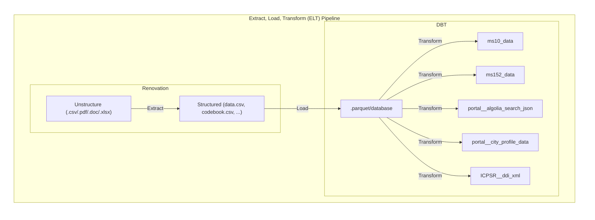

# SALURBAL Renovation/API Repository

## SALURBAL Schematics

(For reference see [CCUH System Schematic](https://github.com/Drexel-UHC/ccuh-data-infrastructure/tree/main#system-schematic))

https://link.excalidraw.com/readonly/qKapVnksy0hDHu801AKy

## Big picture

We are building and Extract, Load and Transform (ELT) pipeline. The goal is to renovate aka **extract** SALURBAL data and metadata to a machine actionable state then **load** this data/metadata into a database where we where we can utilize Data Build Tools (DBT) to orchestrate and document the **transformations** required for SALURBAL. 

Importantly, DBT provides a best practice approach to data management by **automating data transformations**, **validating data integrity**, and allowing us to create a **single source of truth** for their data. Moreover, the **out of the box documentation** is essential for a analytics team like SALURBAL to work effective and efficiently by empowering users to self-service questions about data and enables new team members to on-board quickly.

This repository contains the codebase for the Extraction and Loading parts of our ELT pipeline.

## Renovation Datalakehouse Repository Details (Out of date - needs to update)

- `📁 datasets` contains codebase and metadata for each dataset. The full data is stored on the UHC server directory `\\files.drexel.edu\colleges\SOPH\Shared\UHC\Projects\Wellcome_Trust\Data Methods Core\Dashboards\FAIR Renovations`.
- `📁 datasets_ref` contains extraction-loading code for each dataset.
- `📁 R` contains R functions
- `📁 quarto` contains our quarto documentation site
- `📁 documents` contains templates, supporting docs and presentations

## Resources (Out of date - needs to update)
 - SALURBAL Data Model primer: https://drexel-uhc.github.io/salurbal-fair-renovations/pages/blog/data-models/ 
 - Renovation progress: https://github.com/orgs/Drexel-UHC/projects/1/views/18
 - Renovation documentation: https://drexel-uhc.github.io/salurbal-fair-renovations/
 - Datawarehouse documentation: https://drexel-uhc.github.io/salurbal-dbt/
 - Datawarehouse repository: https://github.com/Drexel-UHC/salurbal-dbt
 - My tasks: https://github.com/orgs/Drexel-UHC/projects/1/views/22
dat) and operationalizes the SALID crosswalks to be used for the data portal. Importantly, it adds public facing id's to existing crosswalks. The final products are stored at `\\files.drexel.edu\colleges\SOPH\Shared\UHC\Projects\Wellcome_Trust\Data Methods Core\Dashboards\FAIR Renovations\_crosswalks`
2. **spatial.R** - takes SALURBAL geodatabases and prepares for use in the data pipeline by: 1) linking to SALURBAL crosswalks generated above 2) simplification of boundaries for web performance 3) converting to open source geoparquet files to be utilized during the data pipeline. 
3. **prototype.R** - import metadata from prototype pipeline (pre-renovation). then adapt for to renovation form for temporary use for variables that renovation is not yet completed. 
4. **src.R** -  cleans individual dataset source details and compiles results for data pipeline use. 
