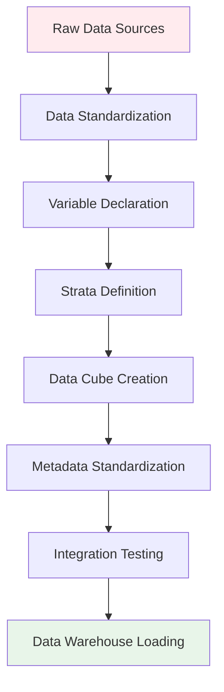

# CubeBuilder-Dev: A Project-Agnostic Data Harmonization Framework

[](https://github.com/your-org/cubebuilder-dev)
[](https://www.r-project.org/)
[](LICENSE)

CubeBuilder-Dev is a development repository for building data harmonization and cube-building capabilities. This repository focuses on creating unified data structures that integrate both data and metadata into queryable cubes for efficient reporting and analysis.

## 🎯 What is a Data/Metadata Cube?

A **data/metadata cube** is a unified data structure that combines raw data with its descriptive metadata into a single, queryable format. This approach enables:

### 🔄 **Join-Free Queries**
- **No complex joins required**: Data and metadata are pre-integrated
- **Single query access**: Retrieve both values and their context simultaneously
- **Simplified analysis**: Users don't need to understand complex table relationships

### 📊 **Efficient Reporting** 
- **Self-documenting datasets**: Every data point includes its full context
- **Automated metadata access**: Variable definitions, units, sources available with data
- **Consistent structure**: Standardized format across all datasets and domains

### 🎯 **Harmonized Data Assets**
- **Multi-source integration**: Combine data from different systems and formats
- **Standardized variables**: Common naming and structure across datasets  
- **Quality assurance**: Built-in validation and provenance tracking
- **Machine-actionable**: Ready for automated processing and distribution

The cube structure eliminates the complexity of managing relationships between data and metadata tables, making harmonized datasets immediately accessible for analysis, reporting, and automated processing.

## 📁 Repository Structure

```
cubebuilder-dev/
├── `_training/`                        # 🎓 Self-contained learning modules
│   ├── 1_area_level_simple/           # → Basic area-level data cube creation
│   ├── 2_record_level_simple/         # → Individual-level data processing  
├── `_shared_storage/`                    # 💾 Shared data storage layer
│   ├── 1_unstandardized/              # → Raw dummy datasets for training 
│   ├── 2_freeze/                      # → Immutable data snapshots  
│   ├── 3_cache_temp/                  # → Interemdiate cache folders
│   ├── 4_standardized/                # → Standardized data and metadata cubes
│   └── 5_datawarehouse/               # → Datawrehouse that orchestrates across cubes
├── R/                                  # 🔧 Core framework functions
│   ├── setup/                         # → Global configuration and setup
│   ├── renovation_functions/          # → Data processing pipeline
│   ├── validation/                    # → Quality control and testing
│   └── metadata/                      # → Metadata management utilities
└── README.md                          # 📖 This file
```

## 🚀 Quick Start: Training Modules

### Prerequisites
- **R 4.0+** with packages: `tidyverse`, `arrow`, `here`
- **RStudio** (recommended for .qmd notebook execution)
- Access to shared storage (local or cloud)

### Training Path

#### 1️⃣ **Module 1: Simple Area-Level Data** (`_training/1_area_level_simple/`)
**Learn**: Basic cube creation, variable standardization, metadata templates
- **Dataset**: Dummy air pollution measurements (PM2.5, NO2, etc.)
- **Complexity**: Single source, no stratification
- **Output**: Area-aggregated environmental data cube

#### 2️⃣ **Module 2: Simple Record-Level Data** (`_training/2_record_level_simple/`)
**Learn**: Individual-level processing, observation IDs, record-to-cube transformation
- **Dataset**: Dummy health survey responses
- **Complexity**: Individual records, basic demographics
- **Output**: Person-level health data cube

### Run a Training Module
```r
# Open training notebook
setwd("_training/1_area_level_simple/")
# Execute _training__1_area_level_simple.qmd in RStudio
```

## 🏗️ Framework Architecture

### Data Processing Pipeline



t

**Development Team**: SALURBAL Data Methods Core, Drexel University
**Primary Contact**: [Contact Information]
**Issues**: Use GitHub Issues for bug reports and feature requests

## 📄 License

MIT License - See [LICENSE](LICENSE) for details

---

*CubeBuilder-Dev represents the evolution of data harmonization from project-specific solutions to generalizable, reusable frameworks. Built on lessons learned from managing complex, multi-national urban health data at scale.*